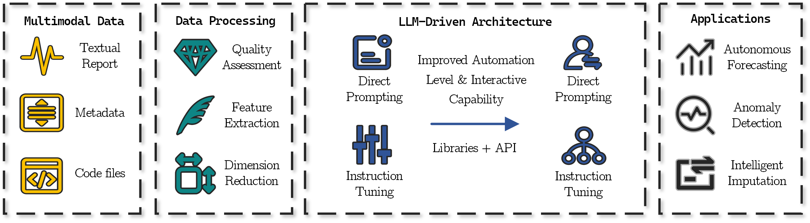
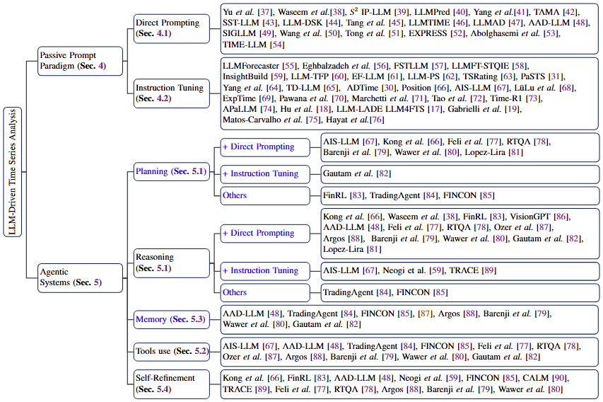

# From Prompts to Agents: A Comprehensive Survey of LLM-Driven Time Series Analysis
From Prompts to Agents: A Comprehensive Survey of LLM-Driven Time Series Analysis

## About This Project
This repository is a continuously updated collection of papers and resources dedicated to **From Prompts to Agents: A Comprehensive Survey of LLM-Driven Time Series Analysis**.

For an in-depth exploration, check out our survey paper: "From Prompts to Agents: A Comprehensive Survey of LLM-Driven Time Series Analysis."

If you find this project valuable for your research, we kindly ask you to consider citing our work:
`
Python ..
`

## Contributions of This Survey
The motivation for this survey is consequently anchored in three critical research gaps: (1) the absence of a unified examination of LLM-based agent architectures tailored for temporal data challenges; (2) the imperative to chronicle the evolution from static model-centric approaches to dynamic, workflow-orchestrating agentic systems; and (3) the need for specialized evaluation frameworks that evaluate agentic competencies beyond conventional accuracy metrics. Our survey directly addresses these gaps by providing a systematic exploration of how LLM agents synthesize perception, planning, tool manipulation, and reflective learning to revolutionize time series analysis. This integrated perspective responds to the escalating demand for autonomous systems capable of navigating the growing complexity and scale of temporal data across diverse application domains.

## Pipeline of This Survey

  

## Taxonomy of This Survey

  

